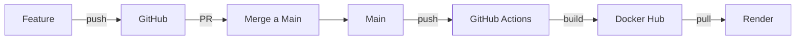

# Flujo de Trabajo para Desarrollo

Este documento explica cómo trabajar con nuevas funcionalidades en el proyecto PVE, usando ramas de Git y el flujo entre desarrollo local y producción.

---

## Estructura de Ramas

### Rama Principal: `main`
- **Propósito:** Producción
- **Dispara:** GitHub Actions automáticamente cuando se hace push
- **Contenido:** Código estable y probado

### Ramas de Funcionalidad: `feature/*`
- **Propósito:** Desarrollo de nuevas funcionalidades
- **No dispara:** GitHub Actions
- **Contenido:** Código en desarrollo

---

## Configuración del Entorno

### Desarrollo Local (sin Docker)

Para trabajar de manera local, necesitás tener un archivo `.env` en la raíz del proyecto:

```bash
# .env (crear este archivo, no está en git)
DB_USER=pve_user
DB_PASSWORD=tu_password_seguro
DB_NAME=pve_db
DB_PORT=5432
JWT_SECRET=tu_jwt_secret_muy_largo_y_seguro_min_64_caracteres
FRONTEND_URL=http://localhost:5173
```

### Comandos para Desarrollo Local

```bash
# Terminal 1 - Backend (puerto 3000)
cd Back/project-pve
npm install  # solo la primera vez
npm run start:dev

# Terminal 2 - Frontend (puerto 5173)
cd Front/project-PVE
npm install  # solo la primera vez
npm run dev
```

El frontend se conectará automáticamente al backend en `http://localhost:3000`.

---

## Flujo de Trabajo

### Paso 1: Iniciar una Nueva Funcionalidad

```bash
# Asegurarse de estar en main y tener los últimos cambios
git checkout main
git pull origin main

# Crear una nueva rama para la funcionalidad
git checkout -b feature/nombre-de-tu-funcionalidad
```

### Paso 2: Desarrollar Localmente

1. Ejecutá los comandos de desarrollo local
2. Realizá tus cambios en el código
3. Probá que todo funcione correctamente

### Paso 3: Guardar Cambios

```bash
# Ver el estado de los cambios
git status

# Agregar archivos modificados
git add .

# Crear commit con mensaje descriptivo
git commit -m "feat: descripción de la funcionalidad"
```

### Paso 4: Subir la Rama a GitHub

```bash
# Subir la rama al repositorio remoto
git push origin feature/nombre-de-tu-funcionalidad
```

### Paso 5: Crear Pull Request

1. Ve a GitHub
2. Crea un Pull Request de `feature/nombre-de-tu-funcionalidad` a `main`
3. Revisa que los cambios estén correctos
4. Mergea el Pull Request

**Importante:** Al hacer merge a `main`, el workflow de GitHub Actions se disparará automáticamente y construirá las imágenes de Docker.

---

## Producción (Render)

### ¿Qué Sucede al Hacer Push a `main`?

1. **GitHub Actions se ejecuta:**
   - Construye la imagen del backend
   - Construye la imagen del frontend
   - Sube las imágenes a Docker Hub con tag `latest`

2. **Render detecta los cambios:**
   -Hace pull de las nuevas imágenes
   - Despliega automáticamente

### URLs de Producción

- **Frontend:** https://pve-frontend.onrender.com
- **Backend:** https://pve-backend-latest.onrender.com

### Variables de Entorno en Render

El frontend ya tiene configurada la URL del backend durante el build mediante el secreto `PRODUCTION_API_URL`.

Para el backend, configurá en Render:
- `DB_HOST` - Host de PostgreSQL
- `DB_PORT` - Puerto (5432)
- `DB_NAME` - Nombre de la base de datos
- `DB_USERNAME` - Usuario de la base de datos
- `DB_PASSWORD` - Contraseña de la base de datos
- `JWT_SECRET` - Secreto para tokens JWT
- `FRONTEND_URL` - https://pve-frontend.onrender.com

---

## GitHub Secrets Configurados

Asegurate de tener estos secretos en tu repositorio de GitHub:

| Secreto | Descripción |
|---------|-------------|
| `PRODUCTION_API_URL` | https://pve-backend-latest.onrender.com |
| `DOCKERHUB_USERNAME` | Tu usuario de Docker Hub |
| `DOCKERHOCKER_TOKEN` | Token de acceso a Docker Hub |

---

## Diagrama del Flujo



---

## Notas Importantes

1. **No hagas push directo a `main`** - Siempre usá ramas de feature
2. **Probá localmente antes de hacer merge** - Asegurate de que todo funcione
3. **El workflow solo se ejecuta en `main`** - Las ramas de feature no disparan Actions
4. **docker-compose.yml fue eliminado** - Solo existe `docker-compose.prod.yml` para producción

---

## Comandos Útiles

```bash
# Ver ramas locales
git branch

# Ver ramas remotas
git branch -r

# Eliminar rama local
git branch -d feature/nombre

# Eliminar rama remota
git push origin --delete feature/nombre

# Ver historial de commits
git log --oneline --graph

# Deshacer el último commit (sin perder cambios)
git reset --soft HEAD~1
```
